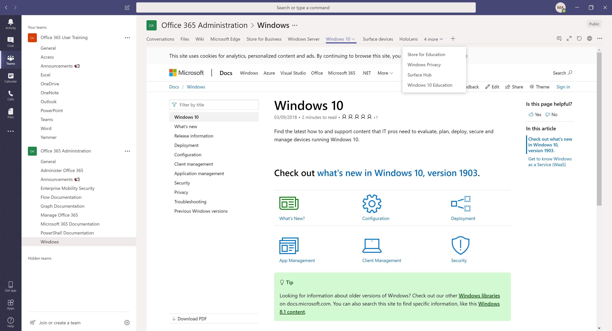

# Teams-Office-365-Administration
Template to create a Microsoft Team in Teams for Administrators. 

This JSON template is intended for companies that have moved to Office 365 and would like to access information in one location for all administrators.

To import the JSON file, you will need to use Microsoft Graph Explorer. https://developer.microsoft.com/en-us/graph/graph-explorer

Login with your admin account to post the JSON file to your Office 365 Tenant. Ensure you have it set to Post - Beta - https://graph.microsoft.com/beta/Teams and hit Run Query.

Once you run the query, it should show the following

This template will create a Team, in Microsoft Teams with the following information. 

<i >(In each channel, there are multiple tabs to Microsoft training resources for that product. The website is loaded inside the tab so users do not need to exit Teams.)</i>

# **Channel:** Manage Office 365
 **Tabs:** Enterprise, Admin help centre, Security and compliance, content roadmap, Manage with PowerShell, Deployment guide

# **Channel:** Administer Office 365
 **Tabs:** Exchange, Office Online Server, Teams, SharePoint, OneDrive, Yammer, Outlook for iOS and Android, Project, Skype for Business, Stream, Kaizala

# **Channel:** Microsoft 365 Documentation
 **Tabs:** Enterprise, Business, Education

# **Channel:** Graph Documentation
 **Tabs:** Overview, Major services and features, Graph Explorer, Use the Microsoft Graph API, Graph REST API v1.0 reference, Graph beta endpoint reference

# **Channel:** PowerShellDocumentation
 **Tabs:** Get Started, Features, Community

# **Channel:** Flow Documentation
 **Tabs:** Get Started, I'm a beginner, I'm an Intermediate, I'm an expert, I'm an admin

# **Channel:** Windows 
 **Tabs:** Windows Server, Windows 10, Windows 10 Education, Store for Business, Store for Education, Windows Privacy, Microsoft Edge, Surface devices, Surface Hub, HoloLens

# **Channel:** Enterprise Mobility Security
 **Tabs:** Azure Active Directory Intune, SCCM, Cloud App Security, Azure Information Protection, AAD Authentication, Advanced Threat Analytics, Azure Advanced Threat Protection, Identity Manager

**Channel:** FastTrack
 **Tabs:** What is FastTrack, FastTrack Portal, Learn more, Benefit for Office 365, Benefit for Enterprise Mobility + Security, Benefit for Windows 10

**Channel:** Insentra Blogs
 **Tabs:** Infomation Security, Application, Delivery and Mobility, Cloud and collaboration, Data migration, Enhanced support
